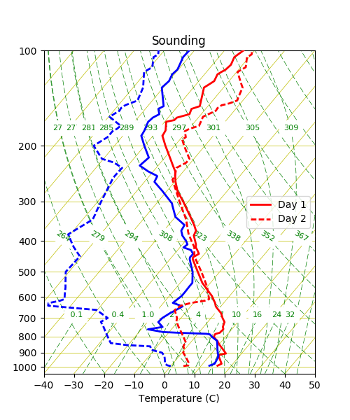

.. _profilePlotting:

Profile Plotting
================

In this chapter the profile plotting capabilities are described of the SkewTplus
package are described in greater detail.

In the following example show how to plot two soundings in the same
Skew-T diagram without any parcel analysis::

    from SkewTplus.skewT import figure
    from SkewTplus.sounding import sounding
    
    #Load the sounding data
    mySounding1 = sounding("./bna_day1.txt")
    mySounding2 = sounding("./bna_day2.txt")
    
    # Create a Figure Manager with a suitable size for both plots
    mySkewT_Figure = figure(figsize=(5,6))
    
    # Add the Skew-T axes to the Figure
    mySkewT_Axes1 = mySkewT_Figure.add_subplot(111, projection='skewx',tmin=-40)
    
    
    # Add one profile to the Skew-T diagram
    # The line style is set to be a solid line and a label is added 
    # to the plot. Since the label is not None, a legend will be added
    # automatically to the plot
    mySkewT_Axes1.addProfile(*mySounding1.getCleanSounding(),
                            hPa=True, celsius=True, parcel=False, 
                            label='Day 1', linestyle='-')
    
    
    # Add a second profile to the Skew-T diagram
    # The line style is set to be a dashed line 
    # The location of the legend is specified to be 
    # 'center right'
    mySkewT_Axes1.addProfile(*mySounding2.getCleanSounding(),
                            hPa=True, celsius=True, parcel=False, 
                            label='Day 2', linestyle='--',loc='center right')
    
    # Show the figure
    mySkewT_Figure.show_plot()

For more details about the different profile plotting options see
:py:meth:`SkewTplus.skewT.SkewXAxes.addProfile`

In the next chapter the Parcel Analysis included in the SkewTplus 
package are described in greater detail:
:ref:`parcelAnalysis`

