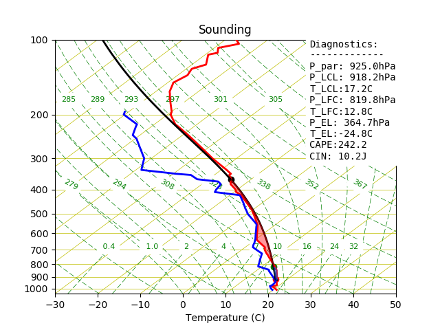

.. _soundingInitialization:

#######################
Sounding Initialization
#######################

The :py:class:`~SkewTplus.sounding.sounding` class supports the following
initialization modes:

* From a University of Wyoming txt file
* From a University of Wyoming Website
* Form an ARM sounding Netcdf file
* From a dictionary with the field names, field values pairs
* Adding individual fields manually

University of Wyoming Sounding Data
===================================

Fetch from txt file
-------------------

The easiest way to get sounding data is to visit the University of 
Wyoming's website:

http://weather.uwyo.edu/upperair/sounding.html

To get some sounding data, follow the link and find the date, and location 
you are interested in, view the data as a text file and just save the file 
to your system. If you want to get loads of data please be considerate about 
the way you go about doing this! (Lots of wget requests makes the server 
administrators unhappy).

You can also pass your own data to SkewT by writing a text file in 
**identical** format to the University of Wyoming files, which are 
constant-width columns. Here's a sample of the first few lines of one of the 
bundled examples::

    94975 YMHB Hobart Airport Observations at 00Z 02 Jul 2013

    -----------------------------------------------------------------------------
       PRES   HGHT   TEMP   DWPT   RELH   MIXR   DRCT   SKNT   THTA   THTE   THTV
        hPa     m      C      C      %    g/kg    deg   knot     K      K      K 
    -----------------------------------------------------------------------------
     1004.0     27   12.0   10.2     89   7.84    330     14  284.8  306.7  286.2
     1000.0     56   12.4   10.3     87   7.92    325     16  285.6  307.8  286.9
      993.0    115   12.8    9.7     81   7.66    311     22  286.5  308.1  287.9

From now on, it's assumed that the package is installed and the current working
directory is the *examples* one, included in this package.

To read a sounding from a txt file and create a quick plot using the default
parameters we only have to do::

    from SkewTplus.sounding import sounding
    
    #Load the sounding data
    mySounding = sounding("./exampleSounding.txt",fileFormat='txt')
    
    #Do a quick plot
    mySounding.quickPlot()
        
The resulting plot will look like this:
        

Fetch from University Of Wyoming Website
----------------------------------------

The sounding class supports getting University of Wyoming sound data 
directly from the UWYO website, we only need to specify the date and
the station id.

For example, to initialize the class with with the sounding from "72558 OAX Omaha"
station, at April 10th of 2017 OO UTC we simple do::

    from SkewTplus.sounding import sounding
    
    #Load the sounding data
    mySounding = sounding("20170410:00",fileFormat='web', stationId= "OAX")
    
    #Do a quick plot
    mySounding.quickPlot()

ARM Sounding Data
=================

The :py:class:`~SkewTplus.sounding.sounding` class also supports 
initialization from ARM sounding data (Netcdf files). For example::

    from SkewTplus.sounding import sounding
    
    #Load the sounding data
    mySounding = sounding("./armSoundingExample.cdf",fileFormat='arm')
    
    #Do a quick plot
    mySounding.quickPlot()

From a dictionary
=================

The :py:class:`~SkewTplus.sounding.sounding` class can be initialized from a dictionary
with "field names" , "field values" pairs.
The Temperature should be in Celsius degrees and the pressure in hPa. 

The next is an example of a dictionary initialization used to plot a sounding from a WRF
output file::

    from netCDF4 import Dataset
    import numpy
    from SkewTplus.sounding import sounding
        
    #Load the WRF File
    wrfOutputFile = Dataset("wrfOutputExample.nc")
    theta = wrfOutputFile.variables["T"][:] + 300 # Potential temperature
    
    # Pressure in hPa
    pressure = (wrfOutputFile.variables['P'][:] + wrfOutputFile.variables['PB'][:]) 
    
    
    qvapor = wrfOutputFile.variables['QVAPOR'][:]
    
    qvapor = numpy.ma.masked_where(qvapor <0.00002, qvapor)
    
    T0 = 273.15 
    referencePressure = 100000.0  # [Pa]
    epsilon = 0.622  # Rd / Rv
    
    # Temperatures in Celsius
    temperature = theta* numpy.power((pressure / referencePressure), 0.2854) - T0
    vaporPressure = pressure * qvapor / (epsilon + qvapor)
    
    dewPointTemperature = 243.5 / ((17.67 / numpy.log(vaporPressure * 0.01 / 6.112)) - 1.) #In celsius
    dewPointTemperature = numpy.ma.masked_invalid(dewPointTemperature)
    
    
    # Now we have the pressure, temperature and dew point temperature in the whole domain
    
    # Select one vertical column , t =0 , x=30, y=30
    
    inputData = dict(pressure=pressure[0,:,30,30]/100, 
                     temperature=temperature[0,:,30,30], 
                     dewPointTemperature=dewPointTemperature[0,:,30,30])
    
    mySounding = sounding(inputData)
    mySounding.quickPlot()

Adding Fields Manually
======================

The :py:class:`~SkewTplus.sounding.sounding` class supports an empty initialization (without any fields).
With the :py:meth:`~SkewTplus.sounding.sounding.addField` method, new fields can be added to the class.
With this kind of initialization full control ever the fields added can be obtained.  
Internally, the class stores the field data values as :py:class:`~SkewTplus.sounding.soundingArray` classes. 
This class is a MaskedArray_ with metadata (long Name,units and missing data value).

.. _MaskedArray: https://docs.scipy.org/doc/numpy/reference/maskedarray.baseclass.html#numpy.ma.MaskedArray

To exemplify the use of this initialization, the previous example of the sounding with WRF data coded to 
use the :py:meth:`~SkewTplus.sounding.sounding.addField` method::
    
    from netCDF4 import Dataset
    import numpy
    from SkewTplus.sounding import sounding
    
    
    #Load the WRF File
    wrfOutputFile = Dataset("wrfOutputExample.nc")
    theta = wrfOutputFile.variables["T"][:] + 300 # Potential temperature
    
    # Pressure in hPa
    pressure = (wrfOutputFile.variables['P'][:] + wrfOutputFile.variables['PB'][:]) 
    
    
    qvapor = wrfOutputFile.variables['QVAPOR'][:]
    
    qvapor = numpy.ma.masked_where(qvapor <0.00002, qvapor)
    
    T0 = 273.15 
    referencePressure = 100000.0  # [Pa]
    epsilon = 0.622  # Rd / Rv
    
    # Temperatures in Celsius
    temperature = theta* numpy.power((pressure / referencePressure), 0.2854) - T0
    vaporPressure = pressure * qvapor / (epsilon + qvapor)
    
    dewPointTemperature = 243.5 / ((17.67 / numpy.log(vaporPressure * 0.01 / 6.112)) - 1.) #In celsius
    dewPointTemperature = numpy.ma.masked_invalid(dewPointTemperature)
    
    
    # Now we have the pressure, temperature and dew point temperature in the whole domain
    
    # Select one vertical column , t =0 , x=30, y=30
    
    mySounding = sounding() # Create an empty sounding
    
    #Add fields
    mySounding.addField('pressure', pressure[0,:,30,30], "Pressure", "Pa")
    mySounding.addField('temperature', temperature[0,:,30,30], "Temperature", "C")
    mySounding.addField('dewPointTemperature', dewPointTemperature[0,:,30,30], "Dew Point Temperature", "C")
    
    mySounding.quickPlot()
    
    
The profile plotting capabilities are described in greater detail in the next chapter:
:ref:`profilePlotting`

